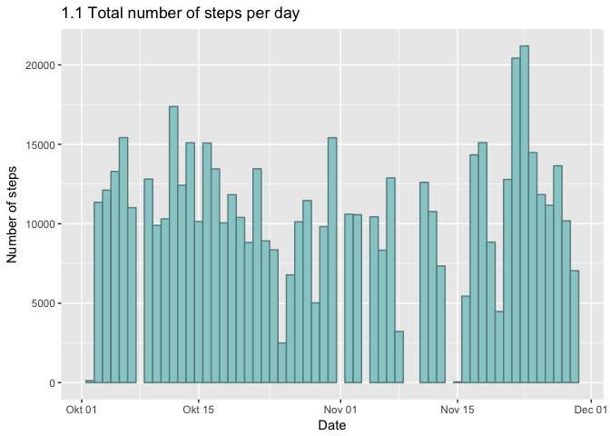
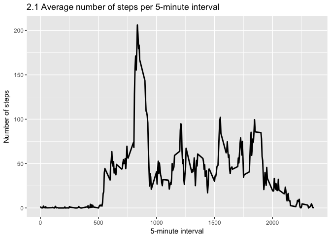
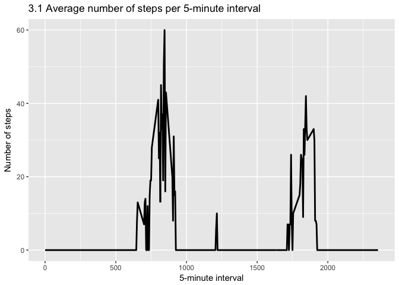
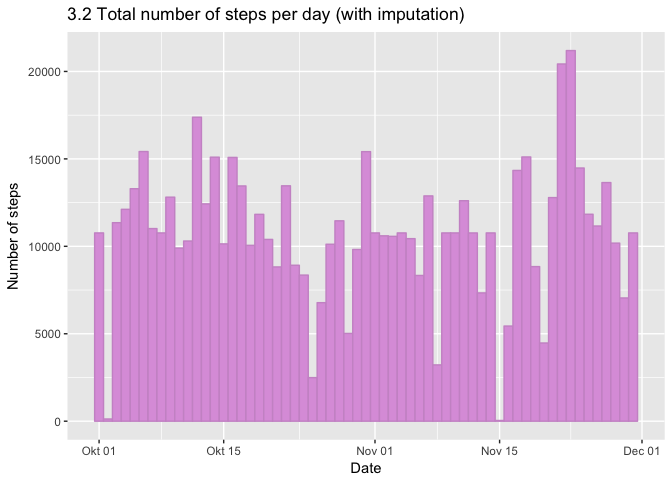
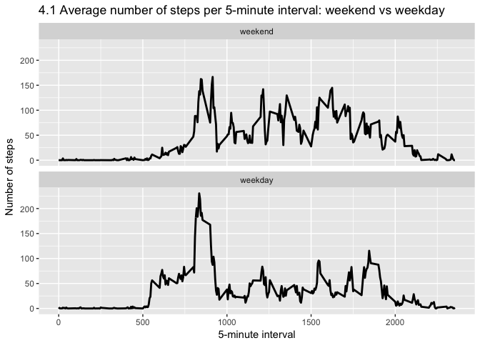

Reproducible Research - Course Project 1
====================================================

### Library requirements

To complete this assignment the following packages are used: ggplot2, plyr, dplyr, timeDate and RCurl.


```r
libraries <- c("plyr", "ggplot2", "dplyr", "timeDate", "RCurl")
lapply(libraries, library, character.only = TRUE)
```

```
## 
## Attaching package: 'dplyr'
```

```
## The following objects are masked from 'package:plyr':
## 
##     arrange, count, desc, failwith, id, mutate, rename, summarise,
##     summarize
```

```
## The following objects are masked from 'package:stats':
## 
##     filter, lag
```

```
## The following objects are masked from 'package:base':
## 
##     intersect, setdiff, setequal, union
```

```
## Loading required package: bitops
```

```
## [[1]]
## [1] "plyr"      "stats"     "graphics"  "grDevices" "utils"     "datasets" 
## [7] "methods"   "base"     
## 
## [[2]]
## [1] "ggplot2"   "plyr"      "stats"     "graphics"  "grDevices" "utils"    
## [7] "datasets"  "methods"   "base"     
## 
## [[3]]
##  [1] "dplyr"     "ggplot2"   "plyr"      "stats"     "graphics" 
##  [6] "grDevices" "utils"     "datasets"  "methods"   "base"     
## 
## [[4]]
##  [1] "timeDate"  "dplyr"     "ggplot2"   "plyr"      "stats"    
##  [6] "graphics"  "grDevices" "utils"     "datasets"  "methods"  
## [11] "base"     
## 
## [[5]]
##  [1] "RCurl"     "bitops"    "timeDate"  "dplyr"     "ggplot2"  
##  [6] "plyr"      "stats"     "graphics"  "grDevices" "utils"    
## [11] "datasets"  "methods"   "base"
```

```r
rm(libraries)
```

### Loading and preprocessing the data

First of all we load the data needed for the assignment. Data is downloaded to a subdirectory "data" in the working directory.


```r
unzip("activity.zip", overwrite=TRUE)
df.activity <- read.csv("activity.csv")
```

When we inspect the data frame we can see the following:

```r
str(df.activity)
```

```
## 'data.frame':	17568 obs. of  3 variables:
##  $ steps   : int  NA NA NA NA NA NA NA NA NA NA ...
##  $ date    : Factor w/ 61 levels "2012-10-01","2012-10-02",..: 1 1 1 1 1 1 1 1 1 1 ...
##  $ interval: int  0 5 10 15 20 25 30 35 40 45 ...
```

```r
summary(df.activity)
```

```
##      steps                date          interval     
##  Min.   :  0.00   2012-10-01:  288   Min.   :   0.0  
##  1st Qu.:  0.00   2012-10-02:  288   1st Qu.: 588.8  
##  Median :  0.00   2012-10-03:  288   Median :1177.5  
##  Mean   : 37.38   2012-10-04:  288   Mean   :1177.5  
##  3rd Qu.: 12.00   2012-10-05:  288   3rd Qu.:1766.2  
##  Max.   :806.00   2012-10-06:  288   Max.   :2355.0  
##  NA's   :2304     (Other)   :15840
```
We note that the variable "steps" contains missing values, which we will address later in this assignment.
Also, the "date"-variable is formatted as a factor variable with 61 levels. For this analysis it's 
more appropriate to have it in a date format, so we transform the variable accordingly:

```r
df.activity$date <- as.Date(df.activity$date, format="%Y-%m-%d")
```

We also create two summarized data frames, one by date and the other by 5-minute interval ("interval"), 
which will be used for our analysis further on.

```r
df.activityDay <- ddply(df.activity, "date", summarize, 
                        totStepsPerDay = sum(steps)
                        )

df.activityInterval <- ddply(df.activity, "interval", summarize, 
                             avgStepsPerInterval = mean(steps, na.rm=TRUE),
                             medianStepsPerInterval = median(steps, na.rm=TRUE)
                             )
```

## Analysis
### Part 1: Mean total number of steps taken per day
In the first part of the assignment we answer the question of what the mean total number of steps taken per day is.
For this part of the assignment, we ignore the missing values in the dataset.

We create a data frame containing the total number of steps taken per day.

```r
df.activityDay <- ddply(df.activity, "date", summarize, 
                        totStepsPerDay = sum(steps)
                        )
```

#### Plot 1.1: Histogram of the total number of steps taken each day

```r
ggplot(df.activityDay, aes(x=date, y=totStepsPerDay)) +
  geom_bar(stat='identity', width=1, fill="paleturquoise3", col="paleturquoise4") +
  labs(title="1.1 Total number of steps per day") +
  labs(x="Date", y="Number of steps")
```

```
## Warning: Removed 8 rows containing missing values (position_stack).
```

<!-- -->

#### Mean and median total number of steps taken per day
We calculate the mean and median total number of steps taken per day. 
Mean:

```r
meanStepsPerDay <- mean(df.activityDay$totStepsPerDay, na.rm=TRUE)
meanStepsPerDay
```

```
## [1] 10766.19
```

Median:

```r
medianStepsPerDay <- median(df.activityDay$totStepsPerDay, na.rm=TRUE)
medianStepsPerDay 
```

```
## [1] 10765
```

### Part 2: Average daily activity pattern

This part of the assignment addresses the question of What the average daily activity pattern is.

We create a a data frame with the mean and median steps taken per 5-minute interval.

```r
df.activityInterval <- ddply(df.activity, "interval", summarize, 
                             avgStepsPerInterval = mean(steps, na.rm=TRUE),
                             medianStepsPerInterval = median(steps, na.rm=TRUE)
                             )
```

#### Plot 2.1 Time series plot, average daily activity pattern
First of all we make a time series plot using ggplot of the 5-minute interval on the x-axis and the average number of steps taken, averaged across all days on the y-axis.

```r
ggplot(data=df.activityInterval, aes(x=interval, y=avgStepsPerInterval)) +
  geom_line(aes(group=1), size = 1) +
  labs(title="2.1 Average number of steps per 5-minute interval") +
  labs(x="5-minute interval", y="Number of steps")
```

<!-- -->

Secondly, we want to knoow which 5-minute interval, on average across all the days in the dataset, contains the maximum number of steps.

```r
subset(df.activityInterval, avgStepsPerInterval == max(avgStepsPerInterval))
```

```
##     interval avgStepsPerInterval medianStepsPerInterval
## 104      835            206.1698                     19
```


### Part 3: Imputing missing values
Now we impute values for all cases where we have missing values.

#### Occurrence of missing values
Before any imputation, we look at how many missing values there are in the dataset.

```r
sum(is.na(df.activity$steps))
```

```
## [1] 2304
```
This is exactly what we could see in the beginning of this assignment when we inspected the dataset with the summary function.

#### Imputing missing values
There are different strategies for imputation. A simple strategy is to use the mean or median values. To choose which of these two strategies to use, we look at a time series plot of the median value per interval, to compare with plot 2.1 

#### Plot 3.1 Time series plot, median activity pattern

```r
ggplot(data=df.activityInterval, aes(x=interval, y=medianStepsPerInterval)) +
  geom_line(aes(group=1), size = 1) +
  labs(title="3.1 Average number of steps per 5-minute interval") +
  labs(x="5-minute interval", y="Number of steps")
```

<!-- -->

There seems to be a large variation between the 5-minute intervals, and in many cases the median is equal to zero. The mean value per interval seems to be a more appropriate strategy for imputation.

We now create a new dataset that is equal to the original dataset but with the missing data filled in.

```r
impute.mean <- function(x) replace(x, is.na(x), mean(x, na.rm = TRUE))
df.activityImput <- df.activity %>%
                      group_by(interval) %>%
                      mutate(steps = impute.mean(steps))
```

#### Plot 3.2 Histogram of mean and median total number of steps taken per day
We create a data frame containing the total number of steps per day with the imputed values:

```r
df.activityImputDay <- ddply(df.activityImput, "date", summarize, 
                             totStepsPerDay = sum(steps)
                             )
```

This can be compared with plot 1.2 which was made using the dataset containing missing values.

```r
ggplot(df.activityImputDay, aes(x=date, y=totStepsPerDay)) +
    geom_bar(stat='identity', width=1, fill="plum", col="plum3") +
    labs(title="3.2 Total number of steps per day (with imputation)") +
    labs(x="Date", y="Number of steps")
```

<!-- -->

We now calculate the mean and median total number of steps taken per day. 


```r
meanStepsPerDayImput <- mean(df.activityImputDay$totStepsPerDay, na.rm=TRUE)
medianStepsPerDayImput <- median(df.activityImputDay$totStepsPerDay, na.rm=TRUE)
```

The mean value of total number of steps taken per day is now

```r
meanStepsPerDayImput
```

```
## [1] 10766.19
```

compared to

```r
meanStepsPerDay
```

```
## [1] 10766.19
```
where no imputation was made.

And for the median total number of steps taken per day:

```r
medianStepsPerDayImput
```

```
## [1] 10766.19
```
with imputation, and


```r
medianStepsPerDay
```

```
## [1] 10765
```
without imputation.

As we can see, the mean value is unchanged. This is not so surprising as we used the mean value for the imputation. The median value is sligtly higher, since the days which earlier was excluded from the calculation due to missing values now have a total amount that is a bit higher than the "original" median.

### Part 4: Differences in activity patterns between weekdays and weekends

This part of the assignment addresses the question if there are differences in activity patterns between weekdays and weekends. For this part we use the dataset with the filled-in missing values.

We create a new factor variable in the dataset with two levels -- "weekday" and "weekend" indicating whether a given date is a weekday or weekend day. To ensure that the code does not depend on system language, I have chosen the function isWeekday from the timeDate package, wich returns the weekend/weekdate as a boolean.

```r
df.activityImput$wDay <- factor(isWeekday(df.activityImput$date), 
                                levels=c(FALSE, TRUE), 
                                labels=c('weekend', 'weekday')
                                )
```

#### Plot 4.1 Panel plot
To compare the patterns of average number of steps taken per 5-minute interval between weekends and weekdays, we make a panel plot with two different time series plots.

First, we create a summarized data frame with the average amount of steps per 5-minute interval and weekend/weekday.

```r
df.activityImputWday <- ddply(df.activityImput, c("interval", "wDay"), summarize, 
                              avgStepsPerInterval = mean(steps, na.rm=TRUE)
                              )
```

Then we create the panel plot:

```r
g <- ggplot(data=df.activityImputWday, aes(x=interval, y=avgStepsPerInterval)) 
g + geom_line(aes(group=1), size = 1) +
    facet_wrap( ~ wDay, nrow = 2, ncol = 1) +
    labs(title="4.1 Average number of steps per 5-minute interval: weekend vs weekday") +
    labs(x="5-minute interval", y="Number of steps")
```

<!-- -->

The most notable difference is in the mornings, which has a higher average rate in the early morning hours and a more distinct peak level at around 8-9 AM.  


